<h2><b>Online Bookstore</b></h2>

An E-Commerce Web Application. The goal of this project is to bring knowledge about E-commerce and how an interactive/user friendly Ecommerce web application can be designed from scratch using 
client-side languages, such HTML and CSS, combined with Java, JSP, Java Servlet and the MVC technology. The Servlet files(see src/java/servlet folder) behave as the controller communicating information between the View aka the JSP files(see /web folder) and Model aka the files conneceting the MySql database(see src/java/model). SQL is used in the backend to build the database and GlassFish is used as the application server.

<h2><b>Description</b></h2>
- The three types of accesses available are: Visitor, User and Admin. 
• <b>Visitors</b> can browse available products but cannot purchase them. 
  - Any visitor can browse through the website and view products but is required to register in-order to purchase products.
 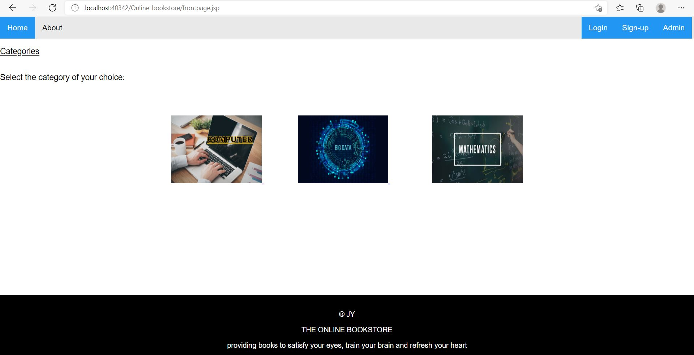 
----------------------------------------------------------------------------------------------------------------------------------
 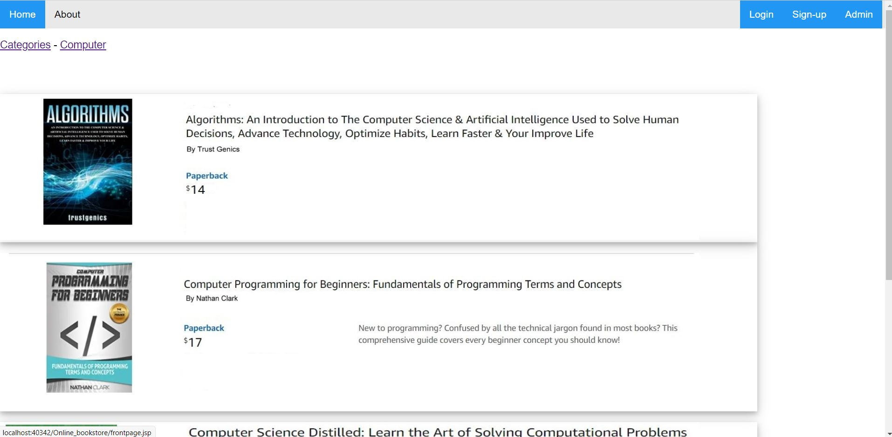 
----------------------------------------------------------------------------------------------------------------------------------
 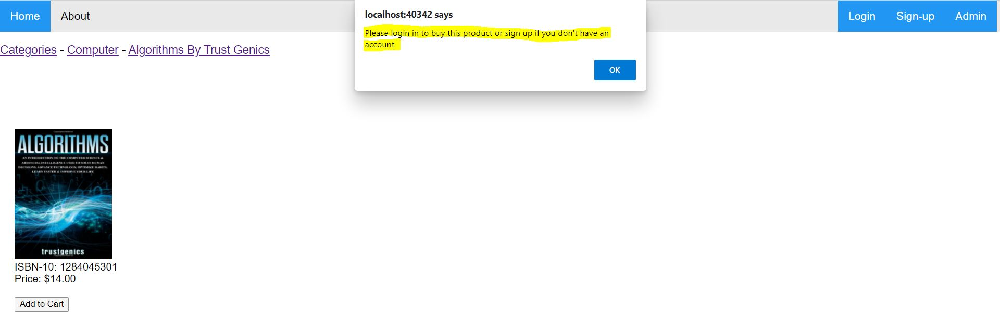 
---------------------------------------------------------------------------------------------------------------------------------- 
  - Visitors can <b>sign-up/register</b> via the signup-page
 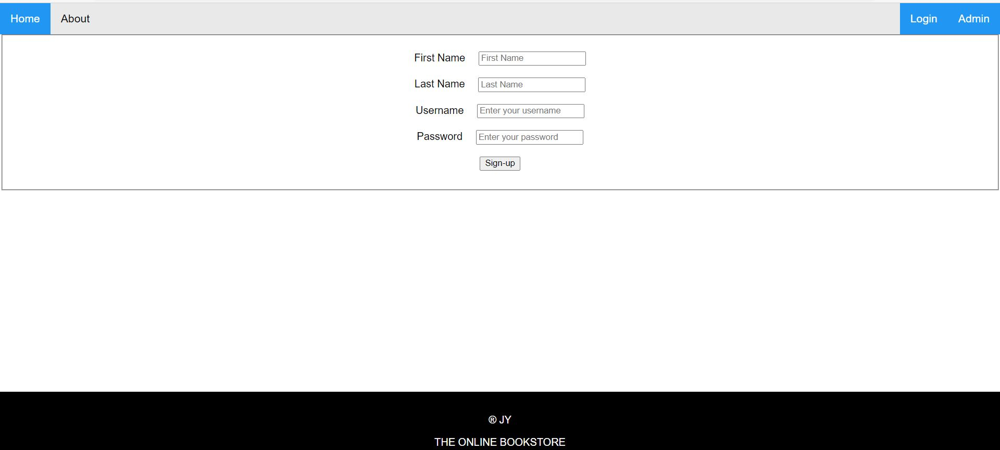 
---------------------------------------------------------------------------------------------------------------------------------- 
• <b>Users</b> can view and purchase products.   
  - Registered users can login via the <b>customer login page</b> and purchase products. 
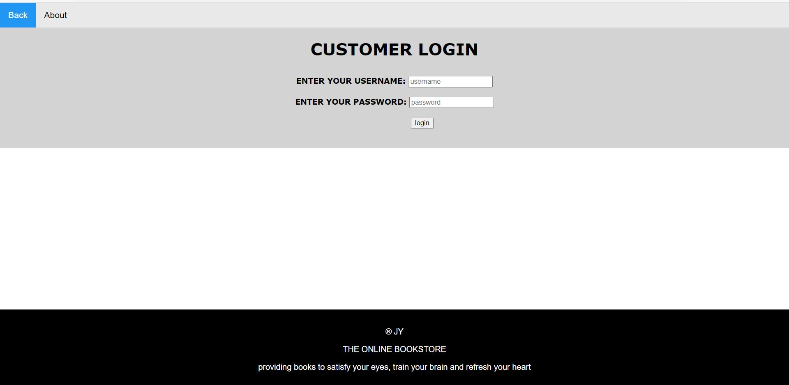 
---------------------------------------------------------------------------------------------------------------------------------- 
  - Credentials are checked with the databse, so an <b>invalid username and password</b> will not let anyone through. 
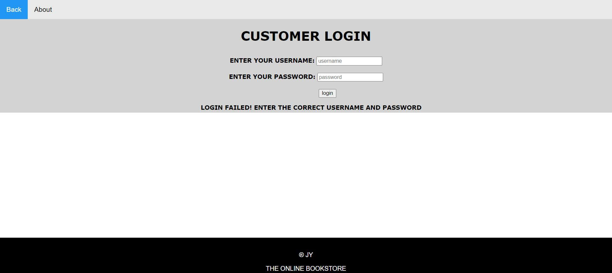 
---------------------------------------------------------------------------------------------------------------------------------- 
  - Products can be added to the customer's <b>cart</b>. Customer has the option to <b>clear cart</b> and/or go to <b>payment page and check-out</b>. 
 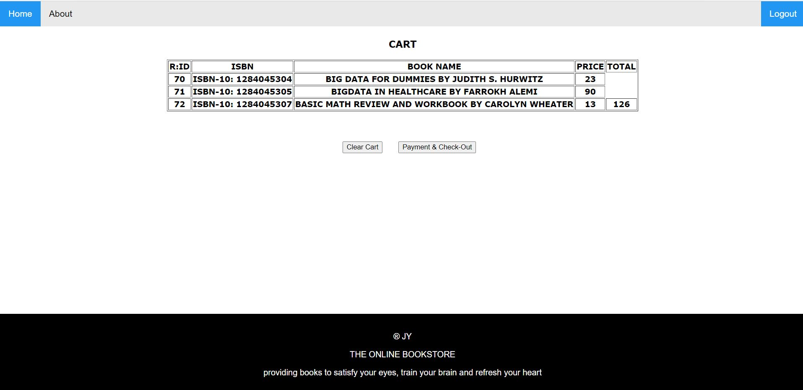 
----------------------------------------------------------------------------------------------------------------------------------
  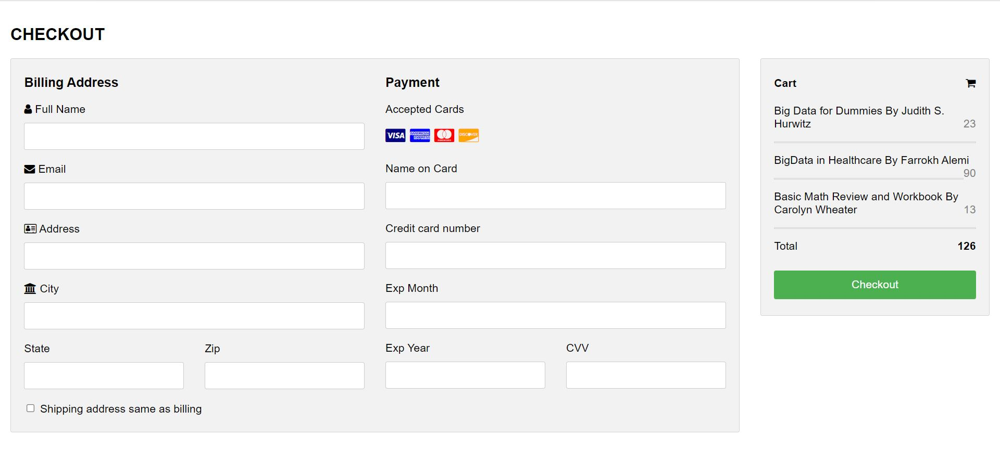 
---------------------------------------------------------------------------------------------------------------------------------- 
• <b>Admin</b> can manage the products(add/remove). 
- Admin has a separate <b>admin login page</b>, <b>front page</b> and can also browse/purchase as a registered user. 
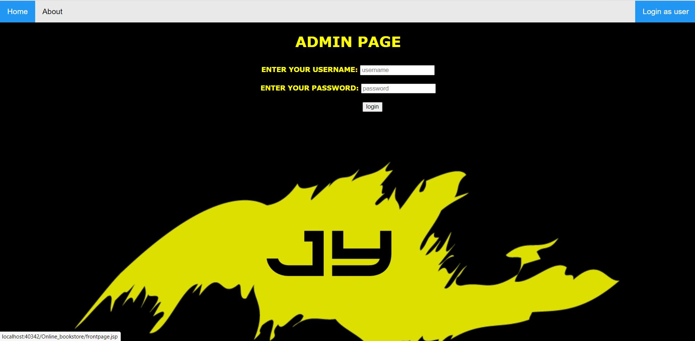 
----------------------------------------------------------------------------------------------------------------------------------
 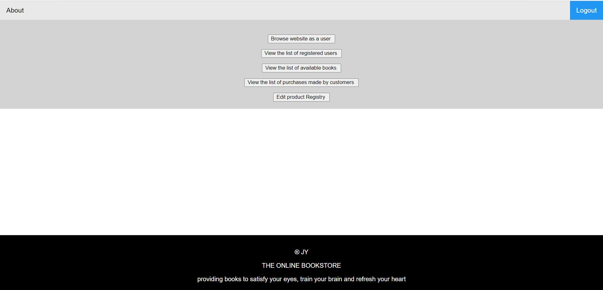 
---------------------------------------------------------------------------------------------------------------------------------- 
- Admin can <b>view, add and remove</b> products. 
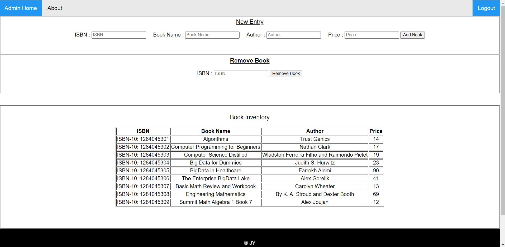 
---------------------------------------------------------------------------------------------------------------------------------- 
- Admin can <b>view names and usernames</b> of all the registered users.  
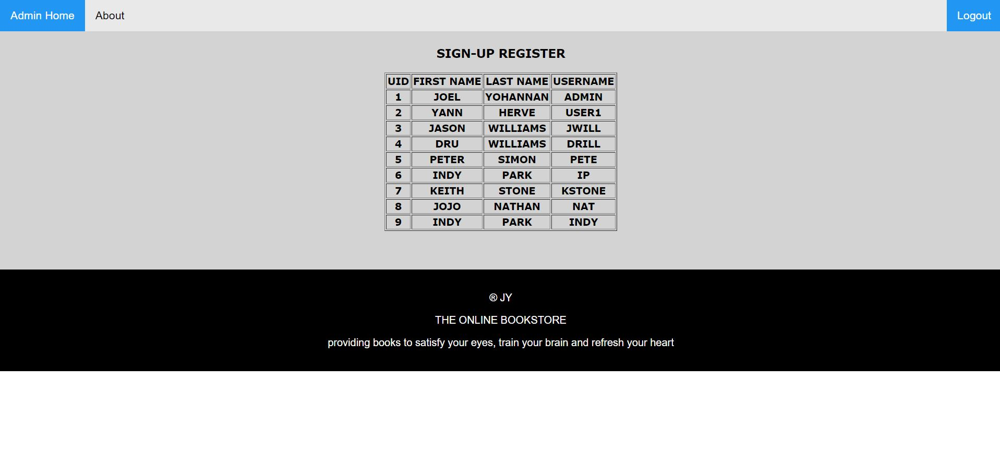 
---------------------------------------------------------------------------------------------------------------------------------- 
- Admin can <b>view the list of all purchases made and total amount earned</b> 
 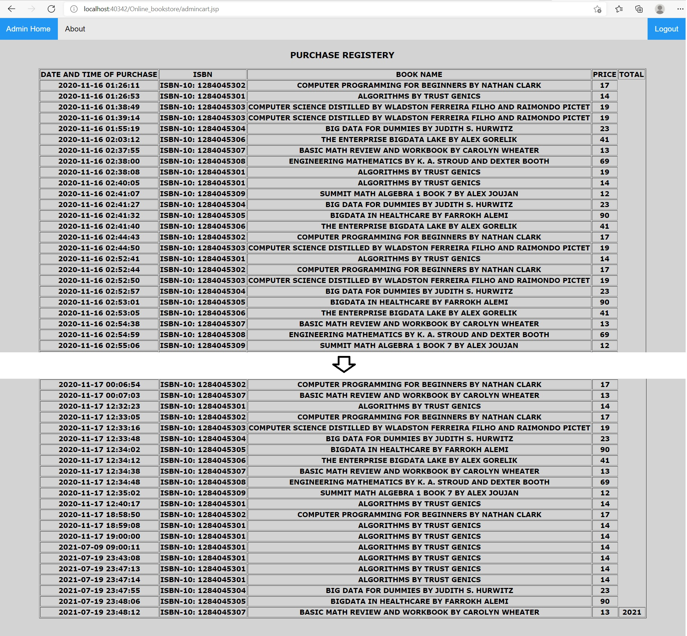 
---------------------------------------------------------------------------------------------------------------------------------- 
- About page is available to contact Admin for queries. 

<h1>CODE CAN BE REVIEWED IN THE SRC/JAVA and WEB FOLDERS<h1>
  
